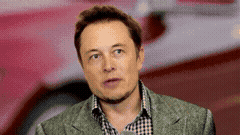
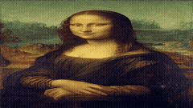
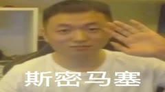

# musetalk-mlx-cases

**musetalk-mlx** 的 demo case 运行器 —— 在 Apple Silicon（MLX，无 PyTorch 运行时）上复刻 [MuseTalk](https://github.com/TMElyralab/MuseTalk) "TestCases For 1.0" 测试集。YAML 驱动多任务推理：音频 + 底片视频 → 口型同步输出视频（ffmpeg 合成音轨）。

作为子目录位于 `musetalk-mlx` 仓库内，通过相对路径（`../.venv`、`../weights-mlx`）消费父仓库的 venv 与转换后权重。

## Cases（复刻 MuseTalk README）

每行 = 输入图 → 底片视频（静态图加 Ken Burns 推镜；sun 用真实动态视频）→ musetalk-mlx 口型同步输出。

| 输入 | 底片视频 | 输出（musetalk-mlx） |
|---|---|---|
| yongen |  |  |
| musk |  |  |
| monalisa |  |  |
| sun1（眨眼增强） |  |  |
| video1 |  |  |

完整结果视频：`results/*.mp4`（可重新生成，不入 git）。

## 快速开始

```bash
# 1. 先建好父仓库环境（venv + 转换后权重）：
cd ..            # musetalk-mlx 仓库根
python3.12 -m venv .venv && source .venv/bin/activate
pip install -e ".[dev]"
# 转换或下载权重到 ../weights-mlx（见父仓库 README）

# 2. 回到本目录，拉取 demo 素材（MuseTalk data，走 hf-mirror）：
cd musetalk-mlx-cases
bash scripts/fetch_assets.sh      # 软链 data/video、data/audio

# 3. 跑全部 case：
./run.sh
# 或单 case：
./run.sh --inference-config configs/inference_cases.yaml --only case_musk
```

## 目录结构

```
inference.py            # 入口：yaml 任务 → 子进程渲染 → ffmpeg 合成
render_worker.py        # 渲染 worker（子进程，隔离 C++ 收尾 abort）
amplify_eyes.py         # 眼部运动放大（低眨眼幅度底片用）
configs/
  inference.yaml        # 2 任务冒烟配置（yongen×yongen、yongen×eng）
  inference_cases.yaml  # 完整 8 case MuseTalk 复刻配置
data/{video,audio}/     # 素材（软链，不入 git）
results/                # 输出 mp4（可重新生成，不入 git）
assets/                 # README 缩略图/gif（入 git）
```

## 配置格式

```yaml
case_musk:                       # 任务 id（任意）
  video_path: "data/video/musk.mp4"   # 相对仓库根
  audio_path: "data/audio/yongen.wav"
  result_name: "case_musk.mp4"        # 输出到 results/ 的文件名
  bbox_shift: -7                 # 可选：人脸 crop y 偏移（sun2 case 用 -7）
```

## 工作原理

1. **`inference.py`** 读 YAML，每个任务经 `render_worker.py` 子进程执行（abort 重试 3 次），再用 ffmpeg 把源音频合入无声渲染。
2. **`render_worker.py`** 驱动 `MuseTalkSession`：分块推音频（保持 ~20s 缓冲不溢出），ffmpeg rawvideo 管道输出（abort 安全 —— C++ 收尾 abort 触发 EOF，ffmpeg 仍写出完整文件），`os._exit` 跳过 `session.close()`（close 路径会触发同一 abort）。
3. **`amplify_eyes.py`**（可选，sun1/sun2 用）：简化欧拉放大眼部 ROI，让眨眼可见 —— MuseTalk 只驱动嘴部，眨眼/身体运动来自底片视频。

## 已知限制（musetalk-mlx 上游）

- **C++ 收尾 abort**：`MuseTalkSession` 渲染线程在会话关闭时可能触发 `There is no Stream(gpu, 0)` abort。已隔离到子进程，输出仍有效。根因在父仓库跟踪。
- **静态图运动**：MuseTalk 只驱动嘴部。官方 case 用 MuseV（CUDA）生成动态视频；无 MuseV 时，静态图 case 用 ffmpeg `zoompan` Ken Burns 推镜（1.0→1.08）让画面整体有运动感。人物本体（眨眼、肢体）仍静态 —— 预期行为。
- **长音频（60s+）**：建议独占 GPU 渲染，避免其他 MLX 进程竞争触发 abort。`MT_BATCH=1` 强制开启以保稳定。
- **MLX 版本**：锁定 `0.32.0`（父仓库要求；0.32.2 在联合编译图上有 decode kernel 回归）。

## 开发者指南

新增 case、配置 bbox-shift、调放大倍数、素材拉取协议见 [`GUIDELINE.md`](GUIDELINE.md)。
